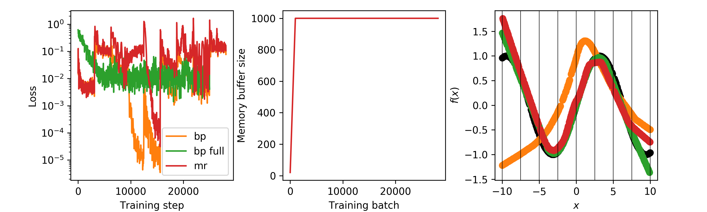
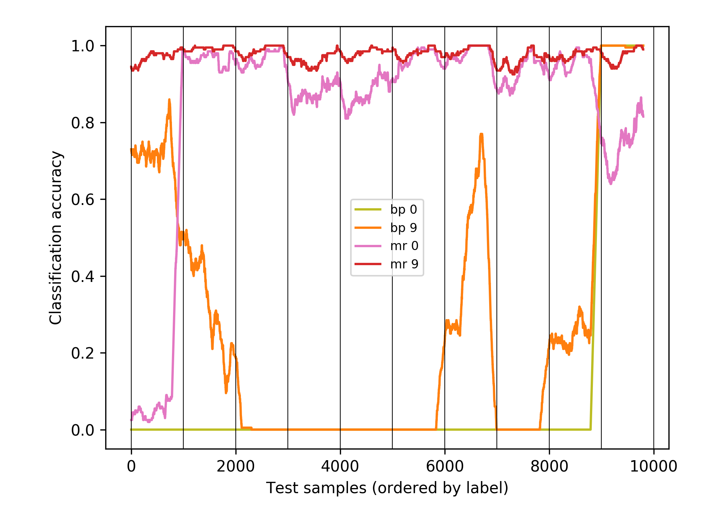

supervised-priority-replay
==========================

Supervised learning in PyTorch with prioritized memory replay.

This implementation demonstrates catastrophic forgetting in ANNs on training data with non-stationary distribution and its mitigation by using prioritized memory replay (Isele & Cosgun, 2018; Rolnick et al., 2018).
We consider two example applications: one-dimensional regression and MNIST classification.
Instead using the current sample (batch) to compute gradients samples are stored in a priority queue ordered by their loss.
To compute parameter updates a memory is randomly sampled from the queue.
Once the queue has reached its maximal size those samples with the lowest loss are discarded.
This process severely attenuates the effect of catastrophic forgetting without requiring the storage of all samples that were ever presented to the network.

   Memory replay prevents catastrophic forgetting in a one-dimensional regression task. A multi-layer network ([1-80-80-1) of rectifying linear units trained with vanilla stochastic gradient descent to approximate the function :math:`f(x) := sin(0.5 x)`. Green: network trained on full data set. Orange: network trained on samples from sequential regions of the x-axis. Red: network trained on samples from sequential regions of the x-axis but using memory replay to compute parameter updates. Final error: :math:`434.5313` (standard SGD), :math:`5.690263` (standard SGD on all samples), :math:`22.83394` (standard SGD + memory replay).

   Memory replay prevents catastrophic forgetting in a hand-written-digit classification task. A convolutional network (see the `PyTorch example`_) trained to classify handwritten digits from the MNIST dataset. Train and test samples are presented in order (first all samples with label 1, then all samples with label 2 etc.). Yellow and orange: classification accuracy after training with standard stochastic gradient descent, after 1 and 10 epochs, respectively. Pink and red: classification accuracy when using memory replay via a priority queue, after 1 and 10 epochs, respectively. Final classification accuracy: :math:`2806/10000 (28%)` (standard SGD), :math:`9771/10000 (98%)` (standard SGD + memory replay).

Literature:
  - Isele, D., & Cosgun, A. (2018, April). Selective experience replay for lifelong learning. In Thirty-Second AAAI Conference on Artificial Intelligence.
  - Rolnick, D., Ahuja, A., Schwarz, J., Lillicrap, T. P., & Wayne, G. (2018). Experience replay for continual learning. arXiv preprint arXiv:1811.11682.

.. _PyTorch example: https://github.com/pytorch/examples/tree/master/mnist
